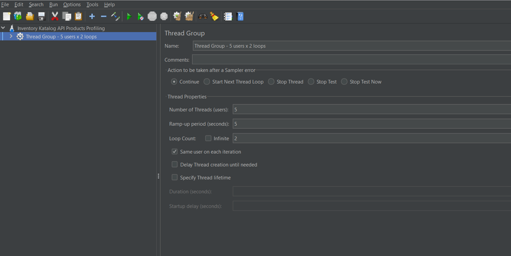
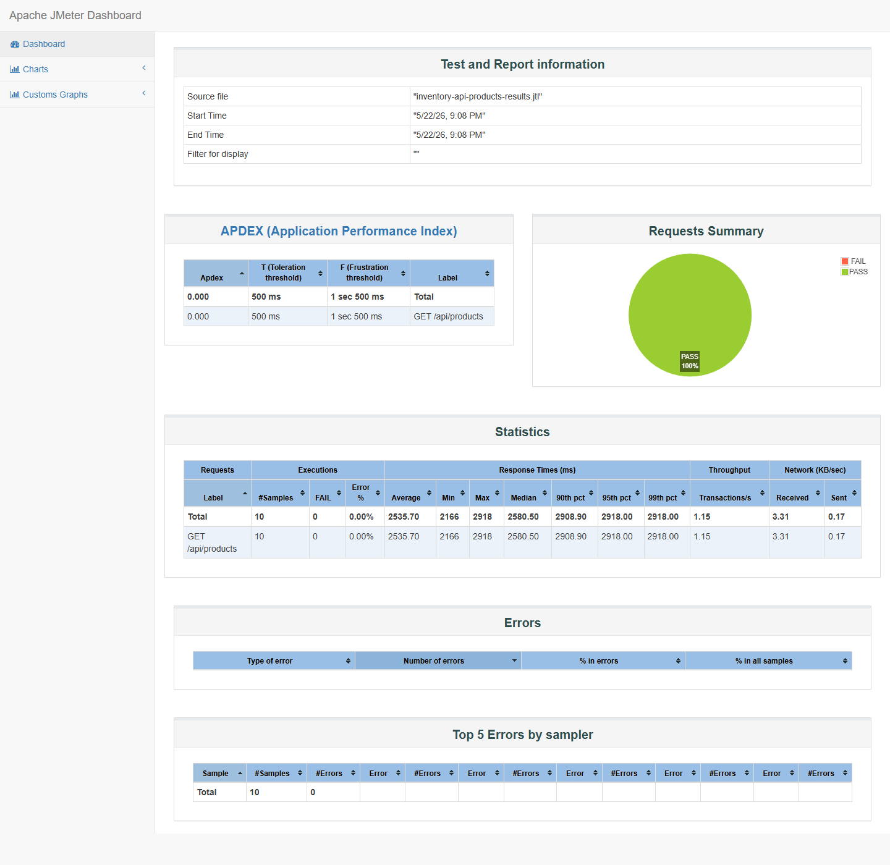
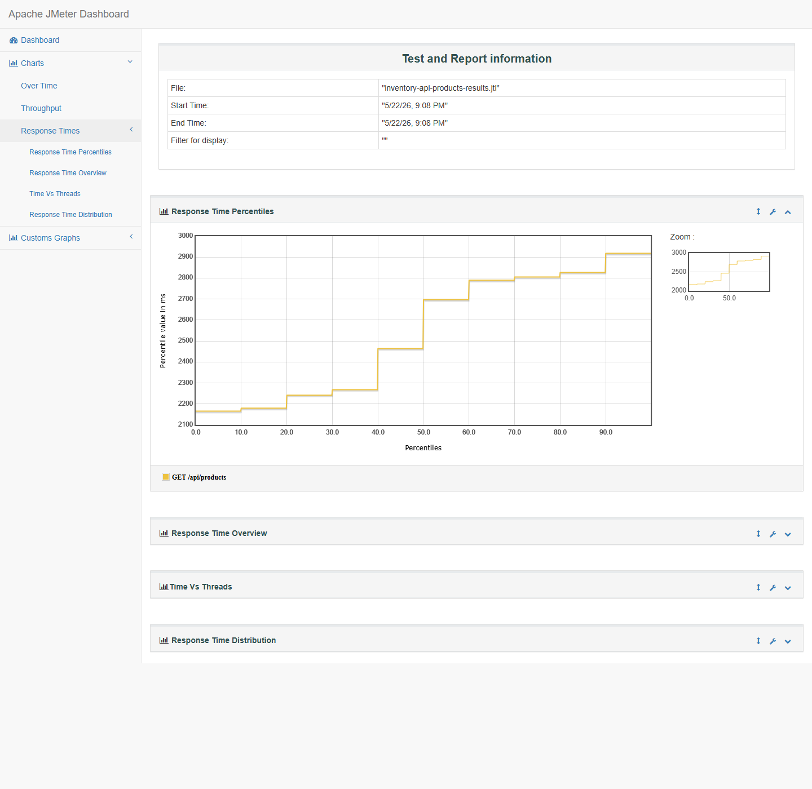

Deploy aws: http://3.219.224.138

# Bukti Profiling dengan Apache JMeter

## Link bukti profiling

- Repository branch monitoring: https://github.com/advprog-2026-A3-project/json-inventory-katalog-service/tree/monitoring
- Target deployment: http://3.219.224.138
- Endpoint yang diprofiling: http://3.219.224.138/api/products
- JMeter test plan: `inventory-api-products-test-plan.jmx`
- Raw JMeter result: `inventory-api-products-results.jtl`

## Screenshot bukti

-  screenshot asli Apache JMeter GUI yang membuka test plan.
-  screenshot dashboard HTML yang di-generate langsung oleh JMeter dari file `.jtl`.
-  screenshot chart Response Time Percentiles yang di-generate langsung oleh JMeter.

## Justifikasi proses profiling

Profiling/performance testing dilakukan dengan Apache JMeter 5.6.3 karena JMeter dapat mensimulasikan user request dan menghasilkan metrik performa seperti response time, percentile, throughput, dan error rate.

Endpoint yang diuji adalah `GET /api/products` karena endpoint ini read-only, aman untuk deployment publik, dan merepresentasikan use case utama katalog yaitu mengambil daftar produk.

Konfigurasi test plan:

- Thread Group: 5 virtual users.
- Ramp-up period: 5 detik.
- Loop count: 2.
- Total sample: 10 request.
- Sampler: HTTP GET `/api/products`.
- Assertion: response code harus `200`.
- Execution: JMeter non-GUI mode untuk run test dan generate HTML dashboard.

Command execution:

```powershell
jmeter.bat -n `
  -t inventory-api-products-test-plan.jmx `
  -l inventory-api-products-results.jtl `
  -e -o jmeter-html-report `
  -j jmeter-run.log
```

## Hasil profiling JMeter

- Samples: 10.
- Error count: 0.
- Error rate: 0.00%.
- Average response time: 2535.70 ms.
- Median response time: 2580.50 ms.
- Minimum response time: 2166 ms.
- Maximum response time: 2918 ms.
- 90th percentile: 2908.90 ms.
- 95th percentile: 2918 ms.
- 99th percentile: 2918 ms.
- Throughput: 1.15 transactions/second.

## Analisis improvement

Endpoint `GET /api/products` berhasil merespons seluruh request dengan HTTP 200, sehingga secara correctness endpoint stabil pada test ringan. Namun rata-rata response time 2535.70 ms dan p95 2918 ms menunjukkan endpoint masih lambat untuk operasi baca daftar produk.

Improvement yang perlu dilakukan:

1. Tambahkan pagination pada `GET /api/products` agar service tidak selalu mengambil seluruh data produk sekaligus.
2. Tambahkan index database untuk field yang sering digunakan dalam query, terutama `nama` dan `jastiperId`.
3. Buat DTO khusus list katalog agar response tidak mengirim field yang tidak diperlukan pada halaman daftar.
4. Pantau metrik p95/p99 latency, throughput, error rate, JVM heap, GC pause, dan HikariCP active/pending connection di Grafana.
5. Setelah optimasi, lakukan retest JMeter dengan konfigurasi yang sama. Target improvement minimal 20% dari baseline average 2535.70 ms adalah sekitar 2028 ms atau lebih rendah.

